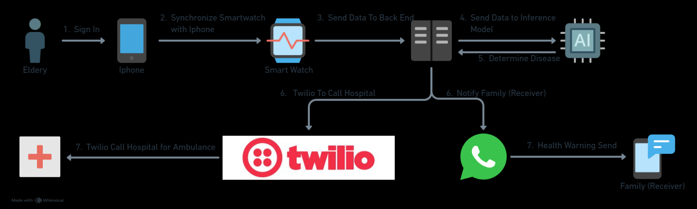

# CAREMO (Care Remote)

CAREMO is a mobile-healthcare system designed to remotely monitor elderly individuals, especially for Non-Communicable Diseases (NCDs) like hypertension or cardiac abnormalities. It uses PPG signals from wearables and provides AI-powered anomaly detection, emergency voice call alerts, and real-time location tracking. CAREMO is composed of two main subsystems:

# System Organization

## Backend System
Responsible for:
- Accepting real-time health data (e.g., PPG, heart rate)
- Performing AI-based anomaly detection
- Handling authentication and role-based access
- Managing database records of users, family members, and health events
- Sending Twilio voice alerts in emergencies
- location services

Technologies: FastAPI, PostgreSQL, Docker, SQLAlchemy, Meta Whatsapp API, Twilio, AI Model

## Frontend System (Mobile IOS + Smart Watch)

# Architecture

## UML Diagram

## Service Flow
