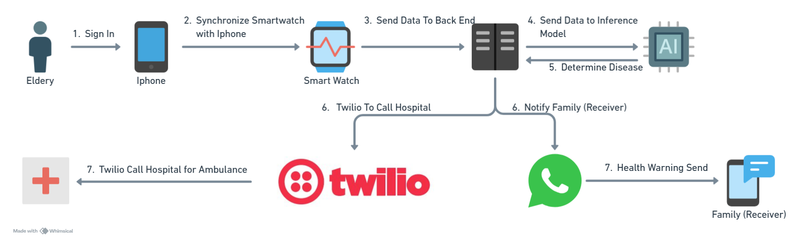

# CAREMO (Care Remote)

CAREMO is a mobile-healthcare system designed to remotely monitor elderly individuals, especially for Non-Communicable Diseases (NCDs) like hypertension or cardiac abnormalities. It uses PPG signals from wearables and provides AI-powered anomaly detection, emergency voice call alerts, and real-time location tracking. CAREMO is composed of two main subsystems:

# System Organization

## Backend System
Responsible for:
- Accepting real-time health data (e.g., PPG, heart rate)
- Performing AI-based anomaly detection
- Handling authentication and role-based access
- Managing database records of users, family members, and health events
- Sending Twilio voice alerts in emergencies
- location services

Technologies: FastAPI, PostgreSQL, Docker, SQLAlchemy, Meta Whatsapp API, Twilio, AI Model

## Frontend System (Mobile IOS + Smart Watch)

The frontend consists of a native **Swift iOS app** that communicates with Apple Watch sensors via **HealthKit**. It receives real-time biometric data, transmits it to the backend, and displays alerts and recommendations to users and caregivers.

### ✅ Features:
- Real-time sync of heart rate and PPG waveform
- Background monitoring using HealthKit + WatchConnectivity
- Emergency alert interface (family/caregiver view)
- Secure OAuth 2.0 login and persona mapping
- Location-based emergency route display

### 📦 iOS Tech Stack:

#### 🍏 Native Apple Frameworks:
- `SwiftUI` — Modern declarative UI framework
- `Combine` — Reactive state handling
- `WatchConnectivity` — iPhone-Apple Watch communication
- `CoreLocation` — GPS location tracking for emergencies
- `HealthKit` — Real-time access to vitals (heart rate, PPG)

#### 📦 Third-party Libraries:
- [Alamofire](https://github.com/Alamofire/Alamofire) `==5.6.4` — HTTP networking (added via Swift Package Manager)

> ℹ️ Apple frameworks are bundled with Xcode and require no manual installation.  
> ℹ️ Alamofire is managed via Swift Package Manager:  
> `File → Swift Packages → Add Package Dependency → https://github.com/Alamofire/Alamofire`

# Architecture

## UML Diagram

## Service Flow
